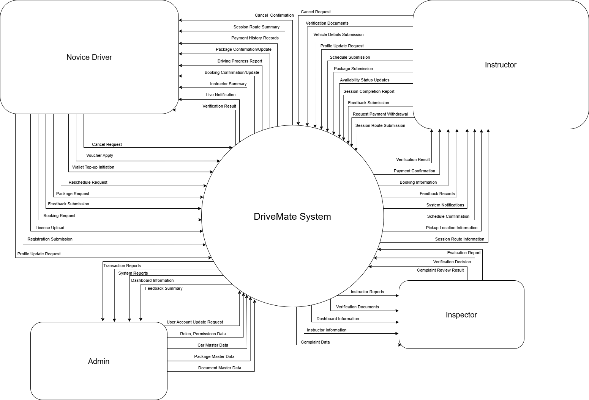
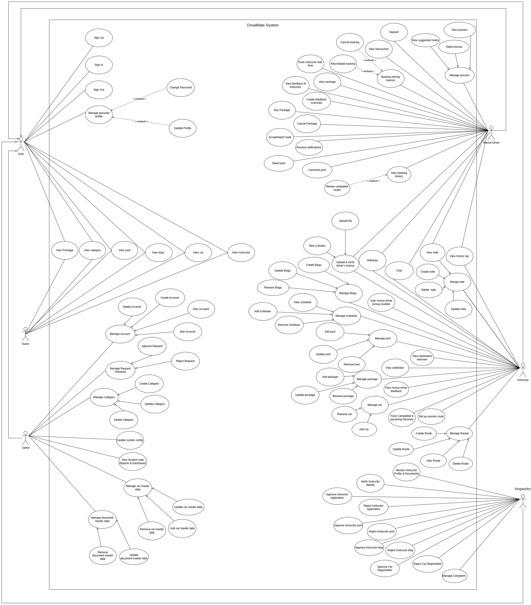

# DriveMate Booking System

DriveMate is a platform designed to support B2-licensed drivers who lack confidence behind the wheel by connecting them with verified driving instructors. The goal is to provide a safe, flexible, and reassuring environment where users can regain control and comfort on the road.
# Document : https://docs.google.com/document/d/1vjmFpkk16MsVsv6w1VbaJidujTV07u7i/edit
# Key Features
- Supervised driving session booking system
- Live tracking and session logging
- Booking history and schedule management

# Actors

- Novice Driver:Register/manage account; upload B2 license for verification; book/reschedule/cancel driving sessions; track instructor vehicle in real time; make payments (VNPay, ZaloPay, PayOS); chat with instructor; receive notifications; view learning progress, session history, and payment history; rate and review instructors.

- Instructor: Register and verify instructor credentials; update profile and availability; manage training schedules; track novice driver location and routes; conduct and confirm driving sessions with notes; view feedback; chat with novice drivers.

- Inspector: Review and verify instructor profiles and documents; approve or reject instructor applications; monitor instructor compliance; view reports and dashboard.

- Admin: Manage user accounts, roles, and permissions; oversee system-wide operations; view reports and analytics.

# System Context Diagram

The context diagram below illustrates the interaction between the external actors and the system.




# Use Case Diagram
The diagram demonstrates the core use cases of the system and the interactions between actors (such as users, instructors, inspectors, and administrators) and the system. It helps identify system requirements and user responsibilities at a functional level.




# 🏗️ System Architecture
The system is designed following a microservices architecture using .NET, ensuring scalability, flexibility, and ease of maintenance. Each core business function is implemented as an independent service, communicating through well-defined APIs.


This system is built using a .NET Microservices Architecture, designed for scalability, modularity, and seamless integration with third-party services.

1️⃣ Overall Architecture

The system is organized into the following core layers:

- **Client Layer**: Web and Mobile applications for Novice Drivers, Instructors, Inspectors, and Admins.

- **API Gateway**: A single entry point that handles request routing, authentication, authorization, and aggregation.

- **Microservices Layer**: Independent ASP.NET Core services, each responsible for a specific business domain.

- **Integration Layer**: Manages communication with external services such as payment gateways, maps, AI, and email providers.

- **Data Layer**: PostgreSQL databases for reliable and persistent data storage.

- **Cloud & Infrastructure Layer**: Supports deployment, cloud storage, logging, monitoring, and system scalability.

# 2️⃣ Microservices Design (.NET)

Each microservice is developed with ASP.NET Core, deployed independently, and can scale based on workload.

Key services include:

- **User Service**: Handles authentication, authorization, and role-based access control.

- **Booking Service**: Manages driving session booking, rescheduling, and cancellation.

- **Resource Service**: Controls instructor profiles, availability, and session confirmations.

- **Payment Service**: Processes payments, refunds, and transaction history.

- **Message Service**: Provides real-time notifications and in-app messaging.

3️⃣ Third-Party Integrations

The system integrates with trusted third-party services to extend functionality:

- **FPT AI**: Enables intelligent features such as chatbot interaction and AI-assisted user support.

- **Goong Map**: Supports real-time location tracking, route planning, and map visualization.

- **Payment Gateways**: *VNPay*, *ZaloPay*, *PayOS*


Secure APIs are used for payment processing, refunds, and transaction validation.

- **Gmail (SMTP / API)**
Sends system emails including account verification, booking confirmations, and payment notifications.

- **Cloudinary**
Provides cloud-based storage for user images and document verification files.

4️⃣ Database Layer

- PostgreSQL is used as the primary relational database.

- Each microservice may use its own database or schema to ensure loose coupling and data isolation.

- Stores user information, booking data, payment transactions, instructor verification records, and system logs.

5️⃣ Security & Communication

- Inter-service and client communication use RESTful APIs over HTTPS.

- JWT-based authentication secures access to system resources.

- Role-based authorization ensures users can only access permitted features.

- Sensitive configurations and third-party credentials are managed via environment variables or secret managers.

✅ Architecture Benefits

- High scalability and independent service deployment
- Improved maintainability and fault isolation
- Easy integration with external services
- Secure and robust system design


## 🧰 Technologies

The project is built using a modern and scalable technology stack, designed to support a microservices architecture, cross-platform development, and real-time communication.

- **Backend**  
  Microservices built with **ASP.NET Core (.NET 8)** and **Ocelot API Gateway** for routing, authentication, and request aggregation.

- **Web Application**  
  Developed using **Next.js 15**, **React 19**, **TypeScript**, and **TailwindCSS** to deliver a high-performance and responsive user interface.

- **Mobile Application**  
  Built with **Expo / React Native**, leveraging **TypeScript**, **Redux Toolkit**, and **SignalR** for real-time features.

---

## 📁 Project Structure

```text
Project/
├── backend/                 # .NET 8 microservices, API Gateway, Docker setup
│   ├── gateway/             # Ocelot API Gateway
│   ├── services/            # Independent microservices
│   └── docker-compose.yml   # Local development orchestration
├── webapp/                  # Next.js 15 web application
└── mobile/                  # Expo / React Native mobile application
## ⚙️ Tech Stack

### Backend
- **.NET 8 (ASP.NET Core)**
- **Ocelot API Gateway**
- **Entity Framework Core**
- **JWT Authentication**
- **Swagger / OpenAPI**
- **Hangfire**
- **SignalR**

### Database
- **PostgreSQL**

### Messaging & Integration
- **RabbitMQ (CloudAMQP)**

### Web Application
- **Next.js 15**
- **React 19**
- **TypeScript**
- **TailwindCSS**

### Mobile Application
- **Expo / React Native**
- **TypeScript**
- **Redux Toolkit**
- **Axios**
- **SignalR**

---

## ✅ Key Technical Advantages

- Microservices-based architecture with independent scalability
- Clear separation between backend, web, and mobile layers
- Real-time communication support across platforms
- Modern, type-safe development stack


